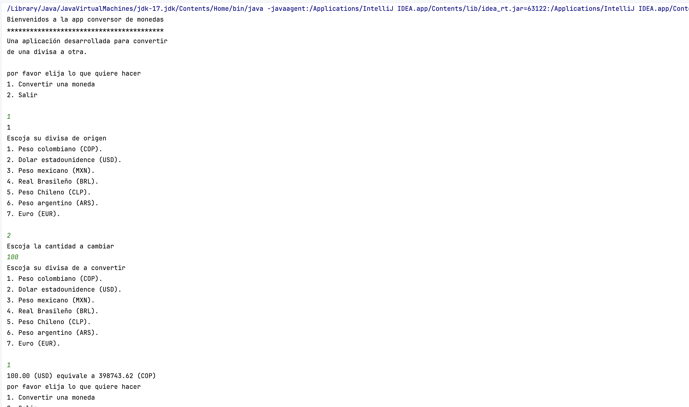

# Currency Converter App
Una aplicación desarrollada para convertir de una divisa a otra.

## Descripción
Esta aplicación permite a los usuarios convertir montos de una divisa a otra utilizando tasas de cambio actualizadas. Es fácil de usar y proporciona conversiones rápidas y precisas entre varias monedas populares.

## Funcionalidades
* Convertir una cantidad de una divisa a otra.
Soporte para múltiples monedas.
* Interfaz de usuario sencilla y amigable.
* Monedas soportadas
  * Peso colombiano (COP)
  * Dólar estadounidense (USD)
  * Peso mexicano (MXN)
  * Real brasileño (BRL)
  * Peso chileno (CLP)
  * Peso argentino (ARS)
  * Euro (EUR)

# Ejemplo de uso
Al iniciar la aplicación, se presentará el siguiente menú:

````
por favor elija lo que quiere hacer
1. Convertir una moneda
2. Salir
````
1. Elige la opción 1 para convertir una moneda.
Se te pedirá que selecciones tu divisa de origen:
````
Escoja su divisa de origen
1. Peso colombiano (COP).
2. Dólar estadounidense (USD).
3. Peso mexicano (MXN).
4. Real brasileño (BRL).
5. Peso chileno (CLP).
6. Peso argentino (ARS).
7. Euro (EUR).
````
2. Selecciona la divisa de origen (por ejemplo, 2 para USD).

3. Ingresa la cantidad que deseas convertir (por ejemplo, 100).

4. Selecciona la divisa de destino:

````
Escoja su divisa de a convertir
1. Peso colombiano (COP).
2. Dólar estadounidense (USD).
3. Peso mexicano (MXN).
4. Real brasileño (BRL).
5. Peso chileno (CLP).
6. Peso argentino (ARS).
7. Euro (EUR).
````
5. La aplicación mostrará el resultado de la conversión:

````
100.00 (USD) equivale a 398743.62 (COP)
````
# Ejemplo de salida del programa
